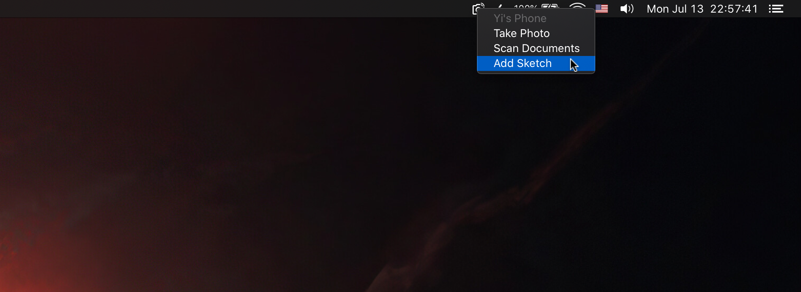

    

<h1 align="center">
   Camera Bop 
</h1>

 Continuity Camera in status bar!

  
    
  

## Feature

* Use iPhone or iPad as an [external camera](https://support.apple.com/en-us/HT209037) in status bar
* Copy to clipboard automatically
* Drag and Drop

## Installation

#### Manual Install

* Download [latest version](https://github.com/LASER-Yi/Camera-Bop/releases/latest) on Mac
* Unzip and drag the app to Applications folder
* Launch and you are ready to go!

## Usage

* Left click status bar icon for opening Continuity Camera context menu.
* Right click for preferences.

## Thanks

[sinresorhus/Preferences](https://github.com/sindresorhus/Preferences) for perference panel

[soffes/HotKey](https://github.com/soffes/HotKey) for global hotkey

## License

MIT © LASER-Yi